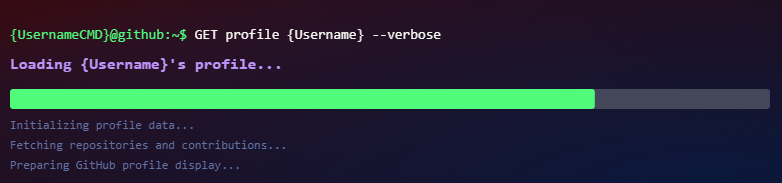

# GitBanner

 


 


## v0.25.9.1 Beta

Create a unique animated GitHub profile banner with terminal-style loading, glitch effects, and metal textures.

Go to [GitBanner Website](https://saviru.github.io/Animated-Profile-Banner-Generator/) to generate your own banner! 

Easy to use, just enter your GitHub username, full name and a description, and download the SVG file.

----
### Sample Banner



<br>
<br>
<details>
    <summary>SVG Format</summary>
    
    <hr>
    <br>
    <p>Slide 1</p>
    
    <p>Slide 2</p>
    
    <p>Slide 3</p>
    
</details>
<br>

### ✨ Features
- Animated terminal-style loading effect in first slide
- Glitch effects with red, green, and blue layers in second slide
- Metal textured text in last slide
- Customizable with your GitHub username, full name, and description
- Downloadable as SVG file for easy use on GitHub profile
- Supports both mobile and desktop views

### 🚀 How to Use
1. Go to the [GitBanner Website](https://gitbanner.qzz.io/)
2. Enter your GitHub username, full name, and a short description
3. Click "Generate Banner"
4. Download the generated SVG file
5. Upload the SVG file to your GitHub profile as a banner image

### 🛠️ Known Issues
- Some old browsers may not render SVG animations correctly.
- There is only one banner style available currently.
- Only supports dark mode.

*These issues will be addressed in future updates.

### 📄 License

```Copyright (c) 2025 Saviru Kashmira Atapattu.```

This project is licensed under the MIT License. See the [LICENSE](LICENSE) file for details.


Developed and maintained by [@Saviru](https://github.com/Saviru)
<br>
<hr>
<p align="center">Made with ❤️ for the GitHub community </p> 